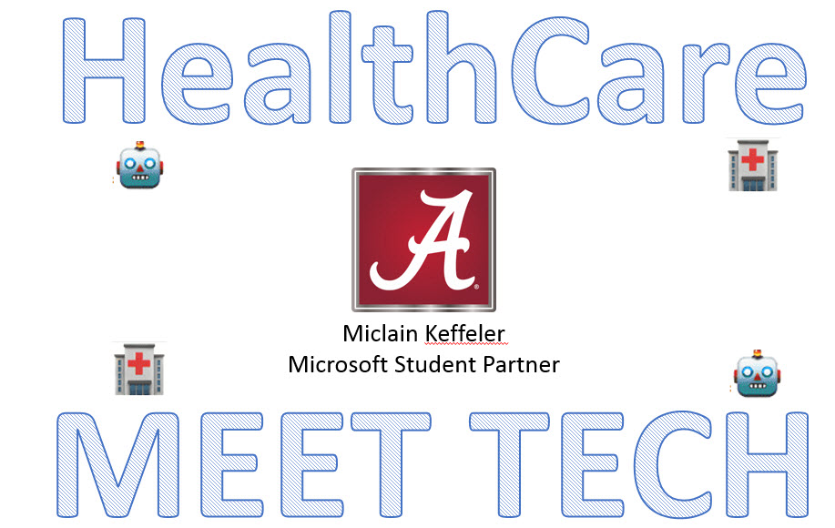

# Cisco_Spark_Challenge
Cisco Spark The Industry Challenge. Use Cisco Spark to experiment with the Spark developer tools to reimagine the way healthcare, education, and sales professionals interact with each other and their customers.

# Links
https://www.ciscospark.com/   https://developer.ciscospark.com/?utm_source=devpost&utm_medium=hackathon&utm_campaign=homepage   https://ciscospark.devpost.com/  
# The Idea
 As of 2010, there was an estimated 450,000 preventable medication-related adverse events that occur in the U.S. every year. With this Cisco Spark Bot, you can tell it what pills you are taking and it will consult the US National Library of Medicine APIs to determine exactly what it is you are taking based on the description or RXCUI (RxNorm Concept Unique Identifier) that uniquely identifies what you are taking. Once it knows everything you are taking, it can then consult another NLM API to determine potentially deadly mixes of prescription drugs. We know there is a need for something like this because of the amount of deaths that are preventable (450K as of 2010). The internet can be confusing, make it easier to confirm your safety with this Cisco Spark Bot!
